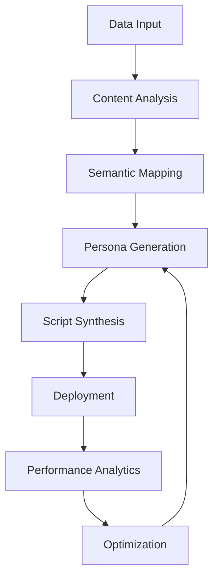

# VoiceGenius AI

<div align="center">
  
  <p><em>Advanced Conversational Intelligence for Enterprise Communication</em></p>
  
  
  
  
</div>

---

## Abstract

VoiceGenius AI is an enterprise-grade platform leveraging cutting-edge natural language processing to revolutionize outbound communication strategies. The system transforms structured and unstructured data into sophisticated, contextually-aware conversational personas that significantly enhance customer engagement metrics and conversion effectiveness.

## Core Capabilities

- **Intelligent Persona Generation**: Algorithmic synthesis of domain-specific conversational agents from multifaceted data sources
- **Dynamic Script Evolution**: Real-time script adaptation based on conversational flow patterns and psychological engagement markers
- **Contextual Personalization Framework**: Granular calibration of communication parameters for optimal audience resonance
- **Performance Analytics Suite**: Comprehensive visualization of engagement metrics with prescriptive optimization pathways
- **Multi-modal Input Processing**: Seamless integration of diverse data formats including audio, textual, and document-based content
- **Collaborative Enterprise Environment**: Secure multi-user framework for team-based communication strategy development

## Technical Architecture

The VoiceGenius AI platform implements a sophisticated microservices architecture:

```
architecture/
├── frontend/            # Responsive UI layer with advanced data visualization
├── api_gateway/         # RESTful service orchestration and authentication
├── ml_pipeline/         # Transformer-based NLP model implementation
├── data_processing/     # Multi-format content extraction and normalization
├── storage_layer/       # Document-oriented persistence with sharding capability
└── analytics_engine/    # Real-time metrics aggregation and insight generation
```

## Implementation Approach



## Setup Protocol

### Prerequisites

- Python 3.8+
- Node.js 16+
- MongoDB 5.0+
- OpenAI API access

### Environment Configuration

```bash
# Clone repository
git clone https://github.com/mynkchaudhry/voicegenius-ai.git
cd voicegenius-ai

# Backend initialization
cd backend
python -m venv venv
source venv/bin/activate  # On Windows: venv\Scripts\activate
pip install -r requirements.txt

# Environment variables
cp .env.example .env
# Edit .env with appropriate credentials

# Service initialization
uvicorn main:app --reload
```

## API Specification

| Endpoint | Method | Description | Authentication |
|----------|--------|-------------|----------------|
| `/api/v1/personas/generate` | POST | Initiates persona generation from source material | JWT |
| `/api/v1/personas/{id}` | GET | Retrieves specific persona configuration | JWT |
| `/api/v1/personas/{id}/customize` | PUT | Modifies persona parameters | JWT |
| `/api/v1/personas` | GET | Lists available personas with pagination | JWT |
| `/api/v1/analytics/performance` | GET | Retrieves engagement metrics | JWT |

## Strategic Roadmap

- **Q2 2025**: Multilingual persona capability with regional linguistic adaptation
- **Q3 2025**: Sentiment analysis integration for dynamic emotional intelligence
- **Q4 2025**: Real-time voice synthesis with paralinguistic feature control
- **Q1 2026**: Enterprise CRM integration suite with bidirectional data flow

## Contribution Framework

Contributions to VoiceGenius AI follow a structured governance model:

1. Fork the repository
2. Create feature branch (`git checkout -b feature/enhancement-description`)
3. Commit changes (`git commit -m 'Add: detailed description of changes'`)
4. Push to branch (`git push origin feature/enhancement-description`)
5. Open Pull Request with comprehensive documentation

## Licensing

This project is licensed under the MIT License - see [LICENSE](LICENSE) file for details.

## Acknowledgments

- Advanced language models provided by OpenAI
- Web framework implementation leveraging FastAPI
- Document processing utilizing PyMuPDF
- Audio transcription powered by Whisper

---

<div align="center">
  <p>Developed and maintained by <a href="https://github.com/mynkchaudhry">mynkchaudhry</a></p>
  <p>© 2025 VoiceGenius AI - All Rights Reserved</p>
</div>